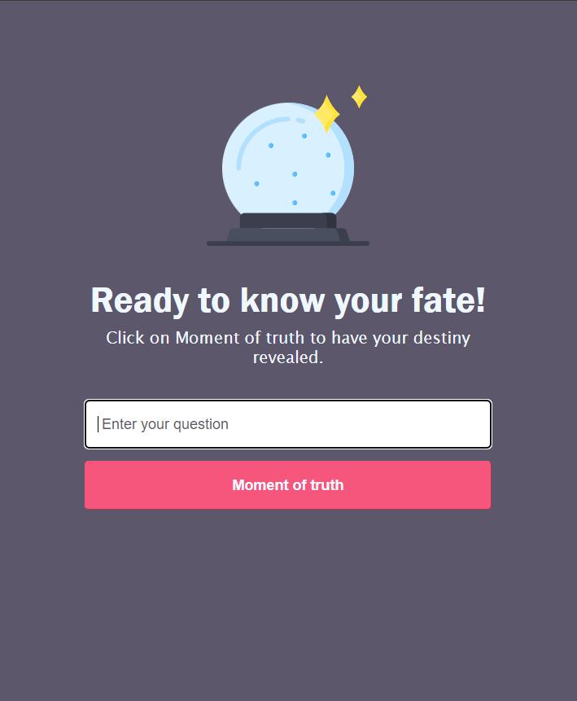

# Destiny|maratona_explore Rockeseat

Have fun figuring out your destiny, build with HTML, CSS, JavaScript .

## 📋 Índice

- [Sobre](#-Sobre)
- [Tecnologias utilizadas](#-Tecnologias-utilizadas)

---

## 🖥 Preview

  

---

## 📖 Sobre

Este é um projeto desenvolvido durante a **[Maratona Explore](https://evento.rocketseat.com.br/maratona-explorer/episodios/explorer/abertura/edicao/1?utm_source=convertkit&utm_medium=leads_cadastrados&utm_campaign=aula-disponivel&utm_term=email&utm_content=aula1-disponivel)**, realizada pela **[@Rocketseat](https://github.com/Rocketseat)** durante os dias 6 a 12 de Junho de 2022.

A proposta do projeto é uma aplicação que possa ligar quem deseja aprender, com quer ensinar. É possível encontrar alunos para o que você leciona, ou encontrar o professor para aquela matéria que você sempre quis aprender mais! Sem que haja nenhuma limitação de área!!

---

## 🚀 Tecnologias utilizadas

O projeto está desenvolvido utilizando as seguintes tecnologias:

- HTML
- CSS
- JavaScript

---

Desenvolvido com 💜 por Caroline Vieira
